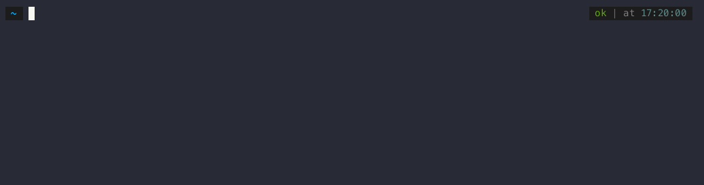

# ybm-cli
A CLI implementation for YB Managed.

# Install with brew

- https://docs.yugabyte.com/preview/yugabyte-cloud/managed-automation/managed-cli/managed-cli-overview/

# Global configuration
This CLI support 3 possibles configurations: 
* Passing values as flags 
  ```sh
  ybm --apiKey AWERDFSSS --host cloud.yugabyte.com cluster list
  ```

* Using a configuration file called `.ybm-cli.yaml` under your `$HOME` directory.
  You can use the command `ybm auth` to help to setup the file

* Using environment variables (all need to start with `YBM_`)
  ```sh
  export YBM_APIKEY=AWERDFSSS
  export YBM_HOST=cloud.yugabyte.com
  ybm cluster list
  ```

By default, `https` will be added to the host if no scheme are provided if you want to use `http` 
just add it to the host `http://cloud.yugabyte.com`



## Commands list
You can find all command documentation [here](./docs/ybm.md)


## Sample Commands:

### Cluster

#### Create Cluster
##### Minimal Required Configurations
```sh
ybm cluster create \
    --cluster-name=test-cluster \
    --credentials=username=admin,password=YBM.Is.Always.Great! 
```

This will use configured default values to spawn the cluster. A single node synchronous cluster will be provisioned in AWS in the `us-west-2` region with 2 vCPUs, 4GB RAM and 10GB disk.
##### All possibilities
```sh
ybm cluster create
    --cluster-name=test-cluster \
    --credentials=username=admin,password=YBM.Is.Always.Great! \
    --cloud-provider=[AWS or GCP] \
    --cluster-type=[SYNCHRONOUS or GEO_PARTITIONED] \
    --node-config=num-cores=<num-cores>,disk-size-gb=<disk-size-gb> \
    --region-info=region=<region-name>,num-nodes=<number-of-nodes>,vpc=<vpc-name> \
    --cluster-tier=[Sandbox or Dedicated] \
    --fault-tolerance=[NONE or ZONE or Region] \
    --database-version=[Production or Innovation or Preview] 
```

#### List Clusters
```sh
ybm cluster list 
```

#### Describe Cluster
```sh
ybm cluster describe \
    --cluster-name=test-cluster-1
```

#### Delete Cluster
```sh
ybm cluster delete \
    --cluster-name=test-cluster-1
```

### Network Allow List

#### Create Network Allow List
```sh
ybm network-allow-list create \
     --name=admins \
     --description="admin allow list" \
     --ip-addr=0.0.0.0/12, 1.1.1.1/12 
```

#### List Network Allow Lists
```sh
ybm network-allow-list list
```

#### Filter Network Allow List
```sh
ybm network-allow-list list \
    --name=admins
```

#### Assign network allow list to cluster
```sh
ybm cluster network allow-list assign \
     --cluster-name=test-cluster \
     --network-allow-list=admins 
```

#### Delete Network Allow List
```sh
ybm network-allow-list delete \
    --name=admins
```

### Read Replica

#### Create Read Replica
```sh
ybm cluster read-replica create \
     --cluster-name=test-cluster \
     --replica=num-cores=<num-cores>,memory-mb=<memory-mb>,disk-size-gb=<disk-size-gb>,code=<GCP or AWS>,region=<region>,num-nodes=<num-nodes>,vpc=<vpc-name>,num-replicas=<num-replicas>,multi-zone=<multi-zone> 
```
The `--replica` tag is optional. If omitted, a single read replica will be created for the given cluster with default values. Additional replicas can be created by repeating the `--replica` flag but each replica must be in a distinct region. For now all the replicas need to be specified while updating. 

#### List Read Replicas
```sh
ybm cluster read-replica list \
    --cluster-name=test-cluster
```
#### Update Read Replicas
```sh
ybm cluster read-replica update \
     --cluster-name=test-cluster \
     --replica=num-cores=<num-cores>,memory-mb=<memory-mb>,disk-size-gb=<disk-size-gb>,code=<GCP or AWS>,region=<region>,num-nodes=<num-nodes>,vpc=<vpc-name>,num-replicas=<num-replicas>,multi-zone=<multi-zone> 
```
The `--replica` tag is optional. If omitted, the cluster will be updated with a single read replica with default values. Additional replicas can be created by repeating the `--replica` flag but each replica must be in a distinct region. For now all the replicas need to be specified while updating.

#### Delete Read Replicas
```sh
ybm cluster read-replica delete \
     --cluster-name=test-cluster 
    
```
All the read replicas will be deleted. To delete only specific read replicas, use the `update` command.

### VPC

#### Create VPC
```sh
ybm vpc create \
    --name=demo-vpc \
    --cloud-provider=GCP \
    --global-cidr=10.0.0.0/18
```

#### List VPCs
```sh
ybm vpc list
```
#### Filter VPC
```sh
ybm vpc list \
    --name=demo-vpc 
```

#### Delete VPC
```sh
ybm vpc delete \
    --name=demo-vpc 
```


### VPC Peering

#### Create VPC Peering
```sh
ybm vpc peering create \
    --name=demo-peer \
    --vpc-name=demo-vpc \
    --cloud-provider=GCP \
    --project=project \
    --vpc=vpc-name \
    --region=us-west1 \
    --cidr=10.0.0.0/18 
```

#### List VPC Peerings
```sh
ybm vpc peering list
```

#### Filter VPC Peering
```sh
ybm vpc peering list \
    --name=demo-peer
```

#### Delete VPC Peering
```sh
ybm vpc peering delete \
    --name=demo-peer
```

### Wait

All the long running commands like the cluster creation, cluster deletion etc have the `--wait` option to wait until the operation is completed. 

```sh
ybm cluster delete \
    --cluster-name=test-cluster \
    --wait
```

If you are using the CLI with the `--wait` flag in your CI system you can specify the environment variable `YBM_CI` to `true` to avoid 
 generating unnecessary logs lines.

By default, the `--wait` option timeout after 7 days, you can reduce or increase this timeout by using the `--timeout` option like 


```sh
ybm cluster delete \
    --cluster-name=test-cluster \
    --wait
    --timeout 24h
```

## Update REST API Client
- make update-cli


